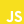

<h1 align="center">👋 Hello There</h1>

I'm Will Featherston, also known as FitzHawke, an enthusiastic Full-Stack Web Developer based in Canada. My passion lies in the world of Web Development, Open-source projects, Web Accessibility, and Design. I enjoy contributing to open source projects and crafting web applications that are responsive, powerful and accessible to everyone.

- 🔨 Currently, I'm immersed in an exciting project called PEFS—a tracking app that currently focuses on personal fitness.
- 🔭 On top of that, I'm diving into the fascinating world of NixOS by researching, testing, and transitioning multiple desktops and servers, while creating configurations for the various programs and services I use.
- 🌱 My learning journey never ceases. At present I'm delving deeper into the Nix language and constantly honing my skills in JavaScript/TypeScript their plethora of associated toolsets.
- ⭐ Fun fact: I used to work as a research specialist in a corn breeding program. As such I have a healthy appreciation for all varieties of corny jokes! 🌽

Join me on this journey as we discover what's possible in the world of web development!

<h6 align="center">Languages and Tools:</h6>

  
  
  
  
  
  
  
  
  
  
  
  
  
  <a href="https://github.com/" target="_blank" rel="noreferrer">
    <picture>
      <source
        media="(prefers-color-scheme: dark)"
        srcset="./assets/tools/github_light.svg"
      />
      <source
        media="(prefers-color-scheme: light)"
        srcset="./assets/tools/github_dark.svg"
      />
      
    </picture>
  </a>
  
  
  
  
  
  
  
  

<h1 align="center">📋 Projects</h1>

<table bordercolor="#66b2b2">
  <tr>
    <td width="50%" valign="top">
      <h3 align="center">PEFS Tracker</h3>
       
      
       
      

        
        
      

      
<strong>Tools</strong> - JS CSS Node Express React Redux MongoDB

    </td>
    <td width="50%" valign="top">
      <h3 align="center">Soxyn</h3>
       
      
       
      

        
        
      

      
<strong>Tools</strong> - Nix NixOS Linux

    </td>
  </tr>

  <tr>
    <td width="50%" valign="top">
      <h3 align="center">Portfolio Page</h3>
       
      
       
      

        
        
      

      
<strong>Tools</strong> - Typescript Astro React Tailwind

    </td>
    <td width="50%" valign="top">
      <h3 align="center">Steve Portfolio</h3>
       
      
       
      

        
        
      

      
<strong>Tools</strong> - HTML CSS JavaScript SCSS

    </td>
  </tr>

  <tr>
    <td width="50%" valign="top">
      <h3 align="center">100D Budget</h3>
       
      
       
      

        
        
      

      
<strong>Tools</strong> - Node Express EJS CSS MongoDB Passport.js

    </td>
    <td width="50%" valign="top">
      <h3 align="center">Dream Home Matcher</h3>
       
      
       
      

        
        
      

      
<strong>Tools</strong> - JS React Redux

    </td>
  </tr>
</table>

<h1 align="center">🔥 Stats</h1>

  <picture>
    <source
      media="(prefers-color-scheme: dark)"
      srcset="https://github-readme-streak-stats.herokuapp.com/?user=fitzhawke&theme=vue-dark"
    />
    <source
      media="(prefers-color-scheme: light)"
      srcset="https://github-readme-streak-stats.herokuapp.com/?user=fitzhawke&theme=vue"
    />
    
  </picture>

  <picture>
    <source
      media="(prefers-color-scheme: dark)"
      srcset="https://github-readme-stats.vercel.app/api/top-langs/?username=fitzhawke&theme=vue-dark&layout=compact"
    />
    <source
      media="(prefers-color-scheme: light)"
      srcset="https://github-readme-stats.vercel.app/api/top-langs/?username=fitzhawke&theme=vue&layout=compact"
    />
    
  </picture>

<h1 align="center">🙋‍♀️ Let's Connect</h1>

  <a href="mailto:will.featherston@gmail.com"
    ><picture>
      <source
        media="(prefers-color-scheme: dark)"
        srcset="./assets/social/dark/email.svg"
      />
      <source
        media="(prefers-color-scheme: light)"
        srcset="./assets/social/light/email.svg"
      />
       </picture
  ></a>
  <picture>
    
  </picture>
  <a href="https://matrix.to/#/@fitzhawke:matrix.org"
    ><picture>
      <source
        media="(prefers-color-scheme: dark)"
        srcset="./assets/social/dark/matrix.svg"
      />
      <source
        media="(prefers-color-scheme: light)"
        srcset="./assets/social/light/matrix.svg"
      />
       </picture
  ></a>
  <picture>
    
  </picture>
  <a href="https://github.com/FitzHawke"
    ><picture>
      <source
        media="(prefers-color-scheme: dark)"
        srcset="./assets/social/dark/github.svg"
      />
      <source
        media="(prefers-color-scheme: light)"
        srcset="./assets/social/light/github.svg"
      />
       </picture
  ></a>
  <picture>
    
  </picture>
  <a href="https://www.linkedin.com/in/will-featherston/"
    ><picture>
      <source
        media="(prefers-color-scheme: dark)"
        srcset="./assets/social/dark/linkedin.svg"
      />
      <source
        media="(prefers-color-scheme: light)"
        srcset="./assets/social/light/linkedin.svg"
      />
       </picture
  ></a>
  <picture>
    
  </picture>
  <a href="https://twitter.com/FitzHawke"
    ><picture>
      <source
        media="(prefers-color-scheme: dark)"
        srcset="./assets/social/dark/twitter.svg"
      />
      <source
        media="(prefers-color-scheme: light)"
        srcset="./assets/social/light/twitter.svg"
      />
       </picture
  ></a>
  <picture>
    
  </picture>
  <a href="https://fitzhawke.com"
    ><picture>
      <source
        media="(prefers-color-scheme: dark)"
        srcset="./assets/social/dark/website.svg"
      />
      <source
        media="(prefers-color-scheme: light)"
        srcset="./assets/social/light/website.svg"
      />
       </picture
  ></a>

